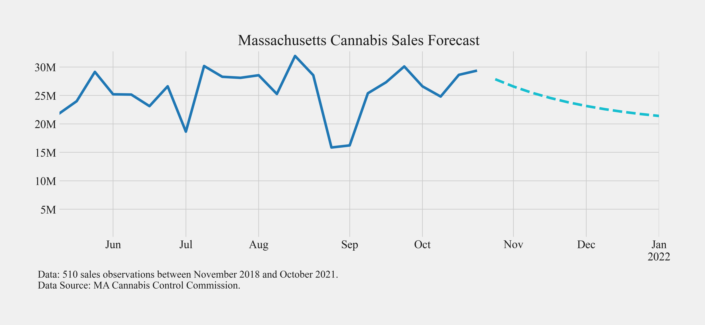

# ARIMA Forecasting

We forecast cannabis sales (and plants) in Massachusetts for the remainder of 2021 and for 2022 using Box-Jenkins methodology (ARIMA modelling). We visualize and save the forecasts so that we can compare the forecasts with actual data in the future.

## Introduction

The 10 Commandments of Forecasting

1. Know what you are forecasting.
2. Understand the purpose of forecasting.
3. Acknowledge the cost of the forecast error.
4. Rationalize the forecast horizon.
5. Understand the choice of variables.
6. Rationalize the forecasting model used.
7. Know how to present the results.
8. Know how to decipher the forecast results.
9. Use recursive methods.
10. Understand that forecasting models evolve over time.

> Silvia, J, Iqbal, A, et. al (2014), "Economic and Business Forecasting".

## Methodology

The script `arima_forecasting.py` walks you though:

1. Getting public Massachusetts cannabis data.
2. Get supplemental data from FRED (Federal Reserve Economic Data).
3. Forecast with weekly sales alone and an ARIMA model.

You end by plotting the ARIMA model forecasts.

*Bonus*: Estimate a VAR model.

## Results

## Data Sources

*MA Cannabis Control Commission*

- [Average Monthly Price per Ounce for Adult-Use Cannabis](https://dev.socrata.com/foundry/opendata.mass-cannabis-control.com/rqtv-uenj)
- [Plant Activity and Volume](https://dev.socrata.com/foundry/opendata.mass-cannabis-control.com/j3q7-3usu)

*Fed Fred*

- [Federal funds interest rate](https://fred.stlouisfed.org/series/FEDFUNDS)
- [Interest rates](https://www.federalreserve.gov/releases/h15/)
